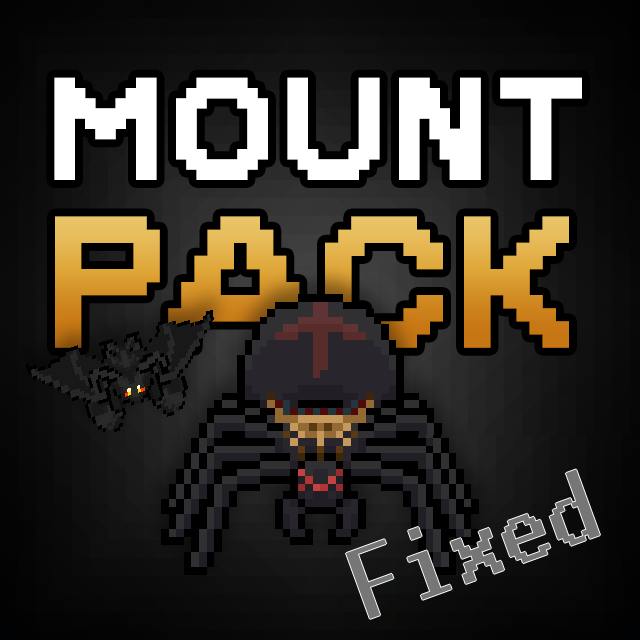

## The Ultimate Mount Pack: Soar and Spin Your Way Through Necesse!

This mod adds three powerful and exciting mounts to Necesse, allowing you to explore the world in new and exciting ways:

**The Swift Bat:**
* Gain night vision during the nighttime for enhanced visibility.

**The Mighty Spider:**
* Gain +10 additional spider summons when using your Spider Staff.
* *These summons disappear when you dismount or use another summon item.*

**The Swift Crocodile:**
* Gain more speed on wather than in land.

**How to Obtain Your Mounts:**

* Defeat the Evil Protector for a chance to get the Bat Mount.
* Defeat the Spider Queen for a chance to get the Spider Mount.
* Defeat the Swamp Guardian for a chance to get the Crocodile Mount.

After defeating these bosses once, your friendly **traveling merchant** may have the mounts for sale.

***This mod is a remake of the original ["Mount Pack"](https://github.com/creativemindpie/mountpack) mod, which has been fixed, updated and improved for compatibility with the latest version of Necesse.***

Installation: [https://steamcommunity.com/sharedfiles/filedetails/?id=3437528294](https://steamcommunity.com/sharedfiles/filedetails/?id=3437528294)